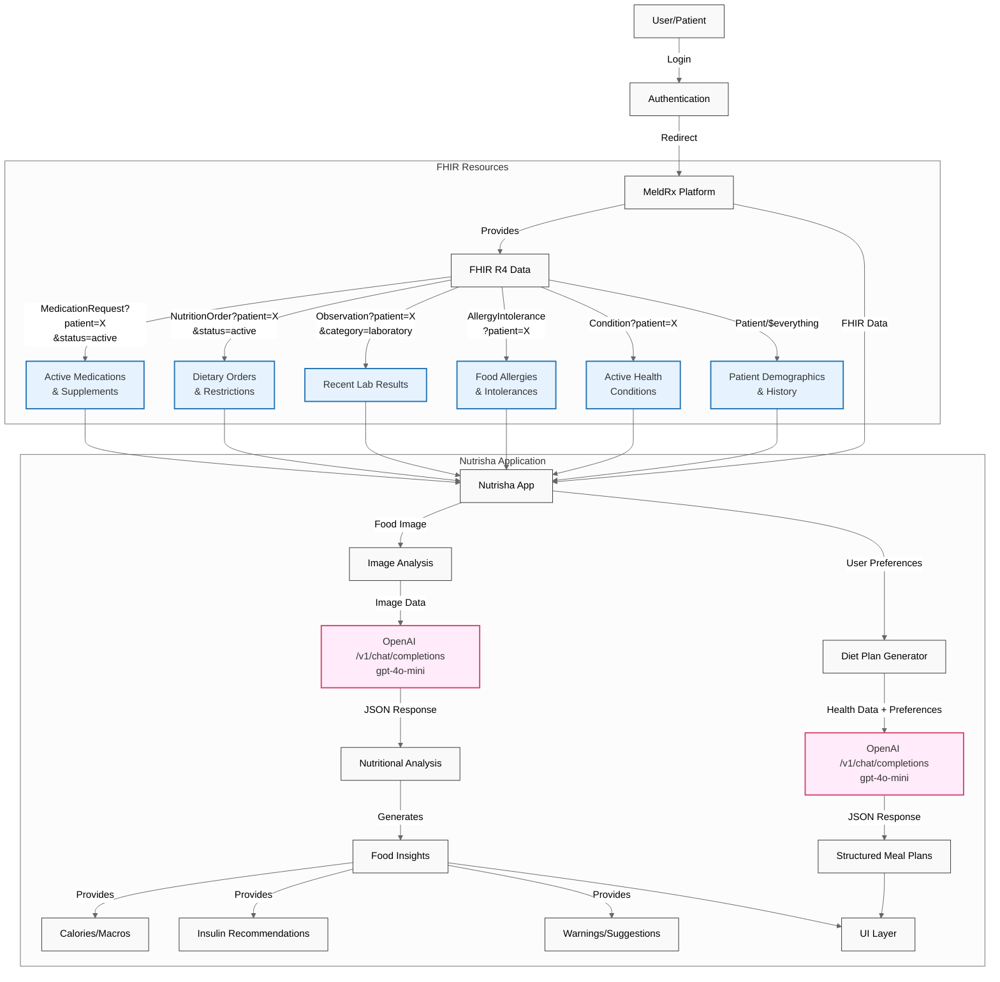

# Nutrisha 🌱

> **MeldRx Hackathon Submission**: Nutrisha combines generative AI with MeldRx's FHIR platform to prevent adverse food-health interactions and provide personalized nutrition guidance, demonstrating significant potential for improving patient outcomes through smart dietary recommendations.

## 🎯 Impact & Functionality

**Key Functionality**:
- Real-time food analysis using gpt-4o-mini vision model
- Personalized meal planning with gpt-4o-mini
- FHIR-powered health context integration
- Automated insulin dosage recommendations

**Healthcare Impact**:
- Prevention of adverse food-medication interactions
- Improved medication timing compliance
- Enhanced dietary adherence through personalization
- Accessible nutrition guidance for patients with complex health conditions

**Predictive Accuracy**:
- Limited to the underlying accuracy of gpt-4o-mini
- Limited to the underlying accuracy of the FHIR resources

**Our Solution**: Nutrisha creates a bridge between clinical health data and daily nutrition decisions by:
- Leveraging FHIR health records for truly personalized recommendations
- Providing real-time food analysis and guidance
- Making clinical nutrition data actionable and accessible

## 🤖 Technical Innovation

### System Architecture

### 🔬 Advanced Integration Features

1. **Comprehensive FHIR Integration**
   - Utilizes 6 critical FHIR resources for complete health context
   - Real-time synchronization with health records
   - Intelligent processing of clinical data for dietary impact

2. **State-of-the-Art AI Implementation**
   - OpenAI gpt-4o-mini for intelligent diet planning
   - OpenAI gpt-4o-mini for real-time food analysis
   - Custom prompt engineering with structured JSON schema responses
   - Advanced vision-language modeling for food recognition

3. **Predictive Healthcare Features**
   - Anticipates medication-food interactions
   - Predicts nutritional needs based on lab trends
   - Suggests preventive dietary modifications

## ✨ Key Features

### 📅 Smart Diet Planning
- **Health-Aware Recommendations**: Automatically considers:
  - Active health conditions
  - Current medications
  - Recent lab results
  - Dietary restrictions
  - Food allergies

### 🔍 AI-Powered Food Analysis
- **Intelligent Image Recognition**: Upload meal photos for:
  - Precise nutritional breakdown
  - Medication interaction warnings
  - Health condition considerations
  - Smart portion recommendations

### 🎨 User Experience
- Intuitive interface with light/dark modes
- Seamless health data integration
- Real-time recommendations

## 🛠️ Technical Setup

## Getting Started
Before launching the app ensure the following configuration steps have been followed:
- app redirect url
  - on https://app.meldrx.com
  - go to `Apps` -> your application
  - in the `Redirect URLs` section
  - add the redirect url `http://localhost:{port}/login-callback` with the same port as this application, by default it's `3000`
- workspace configuration
  - if the workspace is `standalone`
    - you will want to seed it with a patient that you can select to view in this app.
    - go to https://app.meldrx.com/ccda?sample=sample1
    - copy paste the ccda xml in to a new file such as `ccda.xml`
    - go to `Workspaces` -> your workspace -> `Patients` -> click on `Import Data`
    - select the `ccda.xml` file
  - if the workspace is `linked` (to Epic or Cerner etc...)
    - you will want to ignore MeldRx storage, and only use external.
    - go to `Workspaces` -> your workspace -> `Settings` -> `Data Rules`
    - in the `Bulk Updates` section, fill out the form to:
      - `Trigger Action`: `Read`
      - `Resource Type`: `Select All`
      - `Target`: `External`
      - press `Update Rules`

### Preqrequisites
- Node.js

### App Setup/Installation
- Run `npm install`

### App Configuration
- Open `.env`
- Replace the `NEXT_PUBLIC_MELDRX_CLIENT_ID` with the Client Id (aka "MeldRx App Id") of your **MeldRx App** (Get this from the "My Apps" page)
- Replace the `NEXT_PUBLIC_MELDRX_WORKSPACE_URL` with the Workspace URL

### Run the App
- `npm run dev`

## 🏆 Why Nutrisha Wins

1. **Complete Health Context**: Unique integration of multiple FHIR resources for comprehensive health understanding
2. **Advanced AI Implementation**: Cutting-edge use of GPT-4 models for both text and vision analysis
3. **Real-World Impact**: Immediate practical application in preventing adverse health events
4. **Scalable Solution**: Ready for integration with any FHIR-compliant health system
5. **User-Centric Design**: Makes complex health data accessible and actionable

---

**Join us in revolutionizing healthcare nutrition with AI and FHIR! 🌟**

